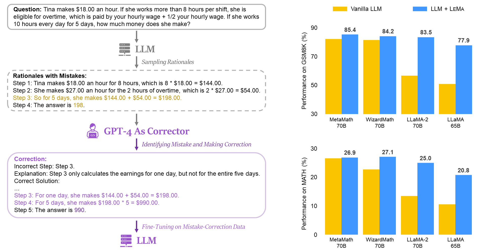

# Learning From Mistakes Makes LLM Better Reasoner

This is the official repo for the paper *Learning From Mistakes Makes LLM Better Reasoner*.

 - paper link: [https://arxiv.org/abs/2310.20689](https://arxiv.org/abs/2310.20689).

<p align="center">
    
    <br>
</p>


## Introduction

Learning from Mistakes (LEMA) enhances the reasoning capabilities of LLMs through **fine-tuning on mistake-correction data pairs**.
LEMA is inspried by the human learning processes.
Consider a human student who failed to solve a math problem, he will learn from what mistake he has made and how to correct it.

| Model | GSM8K | MATH |
|---|-------|---|
| GPT-4 | 92.0  | 42.5 |
| GPT-3.5-Turbo | 80.8  | 34.1 |
| LLaMA-2-7B | 14.6  | 2.5 |
| LLaMA-2-7B + LEMA (ours) | 54.1  | 9.4 |
| LLaMA-2-13B | 28.7  | 3.9 |
| LLaMA-2-13B + LEMA (ours) | 65.7  | 12.6 |
| LLaMA-2-70B | 56.8  | 13.5 |
| LLaMA-2-70B + LEMA (ours) | 83.5  | 25.0 |
| WizardMath-70B | 81.6  | 22.7 |
| WizardMath-70B + LEMA (ours) | 84.2  | **27.1** |
| MetaMath-70B | 82.3  | 26.6 |
| MetaMath-70B + LEMA (ours) | **85.4** | 26.9 |


## Quick Start

### Setup

We recommend using [Conda](https://docs.conda.io/projects/miniconda) or the official [Pytorch Docker](https://hub.docker.com/layers/pytorch/pytorch/2.0.1-cuda11.7-cudnn8-devel/images/sha256-4f66166dd757752a6a6a9284686b4078e92337cd9d12d2e14d2d46274dfa9048?context=explore) to build up the environment.

```sh
git clone https://github.com/microsoft/LEMA.git
cd LEMA
conda create -n LEMA python=3.10.11
conda activate LEMA
pip install torch==2.0.1 # cuda11.7 and cudnn8
pip install -r requirements.txt
```

### Data

Our training data is still under review and might not be released immediately.
Alternatively, we provide our [prompts](./prompts) for generating correction data.
You can use them to construct your own correction data following the process described in our paper.


### Training

We use [QLoRA](https://github.com/artidoro/qlora) to conduct parameter-efficient tuning.
We provide an example of our [training script](./training_code/llama_2_70b_gsm8k.sh).
You can run it on your own correction data.

```sh
# training script
huggingface-cli login # Your huggingface account should have been granted access to llama2 models.
cd training_code
sh llama_2_70b_gsm8k.sh
```


### Evaluation

Our evaluation is based on [vLLM](https://github.com/vllm-project/vllm) (0.1.4) for faster inference.
We need to first merge the fine-tuned adapter into the original base model, and then run vllm inference.

```sh
# Example: evaluation process for llama2-70b on GSM8K
# key dependency: vllm==0.1.4, torch==2.0.1, transformers==4.31.0, peft==0.4.0
# Note: different versions might cause the performance slightly different from our reported results.
huggingface-cli login
cd inference_code

# Step1 1: Merge adapter into base model
python qlora_merge.py \
--base_model meta-llama/Llama-2-70b-hf \
--peft_model {path-to-your-saved-adapters} \
--save_merged_model_path ./Llama-2-70b-GSM8K-LEMA-merged

# Step 2: Run vLLM inference
export NCCL_IGNORE_DISABLED_P2P=1
python vllm_inference.py \
--merged_model_path ./Llama-2-70b-GSM8K-LEMA-merged \
--testdata_folder ./test_data \
--testdata_file gsm8k_test.jsonl \    # use 'gsm8k_test_wizardmath_prompt.jsonl' only for wizardmath models
--output_folder ./Llama-2-70b-GSM8K-LEMA-merged \
--tensor_parallel_size 4              # number of gpus

# Step 3: Calculate Accuracy
python evaluation.py \
--test_data_folder ./test_data \
--test_data_file gsm8k_test.jsonl \
--inference_folder ./Llama-2-70b-GSM8K-LEMA-merged \
--inference_file sample.jsonl
```


## Citation

If you find this repository helpful, please consider citing our paper:

```
@misc{an2023lema,
      title={Learning From Mistakes Makes LLM Better Reasoner}, 
      author={Shengnan An and Zexiong Ma and Zeqi Lin and Nanning Zheng and Jian-Guang Lou and Weizhu Chen},
      year={2023},
      eprint={2310.20689},
      archivePrefix={arXiv},
      primaryClass={cs.CL}
}
```

## Contributing

This project welcomes contributions and suggestions.  Most contributions require you to agree to a
Contributor License Agreement (CLA) declaring that you have the right to, and actually do, grant us
the rights to use your contribution. For details, visit https://cla.opensource.microsoft.com.

When you submit a pull request, a CLA bot will automatically determine whether you need to provide
a CLA and decorate the PR appropriately (e.g., status check, comment). Simply follow the instructions
provided by the bot. You will only need to do this once across all repos using our CLA.

This project has adopted the [Microsoft Open Source Code of Conduct](https://opensource.microsoft.com/codeofconduct/).
For more information see the [Code of Conduct FAQ](https://opensource.microsoft.com/codeofconduct/faq/) or
contact [opencode@microsoft.com](mailto:opencode@microsoft.com) with any additional questions or comments.

## Trademarks

This project may contain trademarks or logos for projects, products, or services. Authorized use of Microsoft 
trademarks or logos is subject to and must follow 
[Microsoft's Trademark & Brand Guidelines](https://www.microsoft.com/en-us/legal/intellectualproperty/trademarks/usage/general).
Use of Microsoft trademarks or logos in modified versions of this project must not cause confusion or imply Microsoft sponsorship.
Any use of third-party trademarks or logos are subject to those third-party's policies.
